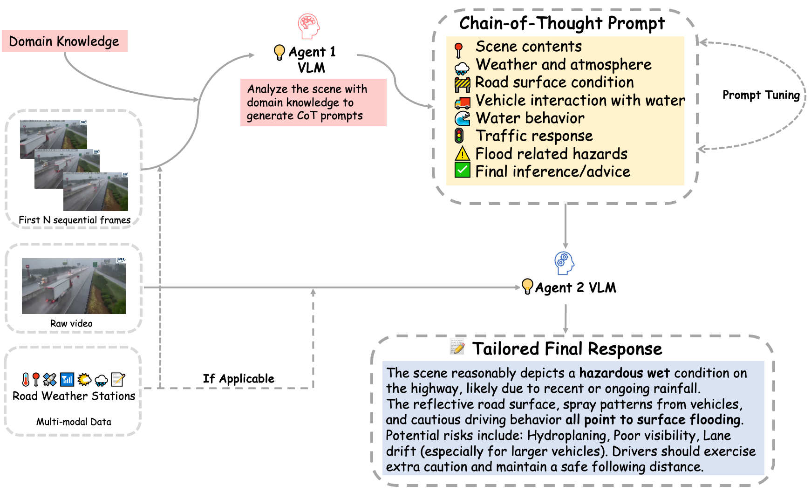
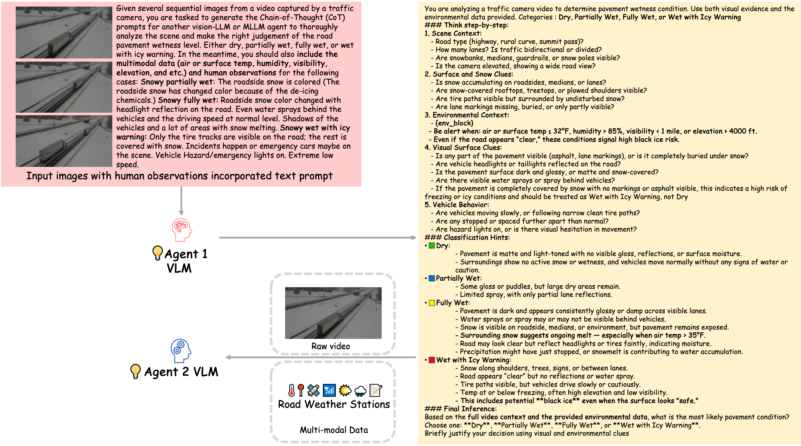

# *Highway Scene Understanding: Multi-agent Collaboration and Reasoning Tool for Visual Inspection and Environmental Watch*

<div align="center">
 <a href="https://arxiv.org/abs/2508.17205">  
    
  </a>
</div>

A multi-agent reasoning tool for **comprehensive highway scene understanding**, built on a **mixture-of-experts strategy**. It integrates multiple critical perception tasks, including **weather classification**, **pavement wetness estimation**, and **traffic congestion detection**. 
<details><summary>Detailed Abstract</summary> 
A multi-agent reasoning tool for **comprehensive highway scene understanding**, built on a **mixture-of-experts strategy**. It integrates multiple critical perception tasks, including weather classification, pavement wetness estimation, and traffic congestion detection. By orchestrating specialized vision-language models (VLMs) through task-specific chain-of-thought (CoT) prompting, the tool enables robust multi-task reasoning and achieves significant performance improvements across all evaluated tasks. Experimental results demonstrate consistently high accuracy across diverse scenarios. In practical deployment, the tool can be integrated with the extensive network of existing traffic cameras. In rural areas, where traditional sensor coverage is limited and cellular connectivity may be sparse, it supports strategic monitoring by focusing on high-risk locations such as **sharp curves**, **flood-prone lowlands**, and **icy bridges**. By continuously analyzing scene conditions at these targeted sites, the tool enhances situational awareness and delivers timely alerts, even in disconnected environments.
</details>

<br>
<span>
<b>Authors:</b> 
<a class="name" target="_blank" href="https://winstonyang117.github.io/">Yunxiang Yang<sup>1</sup></a>, 
<a class="name" target="_blank" href="https://github.com/XComedian">Ningning Xu<sup>2</sup></a>, 
<a class="name" target="_blank" href="https://engineering.uga.edu/team_member/jidong-yang/">Jidong Yang<sup>1,†</sup></a> 
<br>
<sup>†</sup>Corresponding Author.
</span>

### 🎬 Weather Understanding Demo


### 🎬 Pavement Wetness Estimation Demo


### 🎬 Traffic Congestion Detection Demo


# 🔥News
- [2025/08/24] The paper is published on Arxiv, <a href="https://arxiv.org/abs/2508.17205">click here</a>
- [2025/08/05] We released our pipeline, framework, and demos. Effective CoT prompts for different downstream tasks and the paper will be released soon.

<br>

## Framework


## Example of CoT prompt generation for pavement wetness level assessment under snowy conditions


<br>

### Implementation Details
1. We employed [ChatGPT-4o](https://chatgpt.com/) as agent 1, and [Qwen2.5-VL 7B](https://github.com/QwenLM/Qwen2.5-VL) as agent 2.
2. Please follow [Qwen2.5-VL](https://github.com/QwenLM/Qwen2.5-VL) official repository to install the environment.

### Data Preparation

1. You can access the video data on public traffic streaming wetsites: [511 Virginia](https://511.vdot.virginia.gov/), [511 GA](https://511ga.org/cctv?start=0&length=10&order%5Bi%5D=1&order%5Bdir%5D=asc), and [Caltrans](https://cwwp2.dot.ca.gov/vm/iframemap.htm).
2. Build and organize the datasets as follows:
```
SceneUnderstanding/
    |__ WeatherUnderstanding/
        |__ clear/
        |__ Rainy/
        |__ Snowy/
    |__ WetnessEstimation/
        |__ RainyPartiallyWet/
        |__ RainyFullyWet/
        |__ RainyFlooded/
        |__ SnowyPartiallyWet/
        |__ SnowyFullyWet/
        |__ SnowyWetWithIcyWarning/
        |__ SunnyDry/
    |__ CongestionDetection/
        |__ Obstructed/
            |__ Inbound/
            |__ Outbound/
        |__ Unobstructed/
            |__ Inbound/
            |__ Outbound/
```

## Citation

If you find this repository is helpful for your research, please consider citing our paper:

```bibtex
@article{yang2025multiagent,
      title   = {Multi-Agent Visual-Language Reasoning for Comprehensive Highway Scene Understanding},
      author  = {Yang, Yunxiang and Xu, Ningning and Yang, Jidong J.},
      journal = {arXiv preprint arXiv:2508.17205},
      year    = {2025}
}
```
